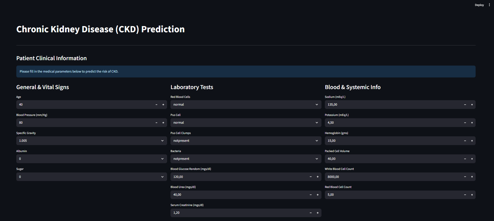
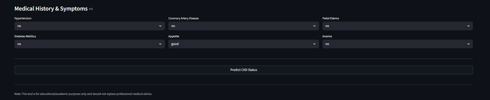

# CKD-Predictor: An End-to-End Clinical Decision Support System

# Project Overview:
This project focuses on the early detection of Chronic Kidney Disease (CKD) using a Machine Learning approach. By analyzing clinical and laboratory parameters, the system provides a high-accuracy assessment of patient risk. It is designed as a complete software solution, moving from raw medical data cleaning to an interactive web-based deployment.

# Key Engineering Highlights:
+ Leakage-Free Pipeline: Implemented a standardized Scikit-learn Pipeline that encapsulates both preprocessing (imputation, scaling, encoding) and the classifier to prevent Data Leakage during the training/testing process.
+ Robust Data Engineering: Custom cleaning scripts to handle "dirty" medical data, including hidden tab characters, irregular missing value indicators (?), and data type inconsistencies.
+ Modular Architecture: Organized code into a professional structure (Src/, Data/, main.py), ensuring scalability and maintainability according to industry best practices.

# User Interface Preview:

# Project Structure:

Predicting_chronic_kidney_disease/
├── Data/                   # Raw and cleaned datasets (Excel/CSV)
├── Src/                    # Source code modules
│   ├── preprocessing.py    # Data cleaning and feature engineering
│   ├── train.py            # Model training and evaluation logic
│   └── model_pipeline.pkl  # Serialized production-ready model
├── main.py                 # Streamlit application entry point
├── requirements.txt        # List of dependencies
└── README.md               # Documentation

# Technical Stack:
+ Language: Python (Pandas, NumPy)
+ Machine learning: Scikit-learn (Random Forest)
+ Deployment: Streamlit
+ Storage: Joblib (Model Serialization)

# Model Performance & Evaluation:
The model achieved optimal performance on the test set. To ensure robustness and verify it's not just "overfitting," rigorous evaluation was conducted:

    + Accuracy/Recall/F1-Score: 1.0 (on a 20% test split).
    + Cross-Validation: Validated stability across multiple folds to confirm predictive power.